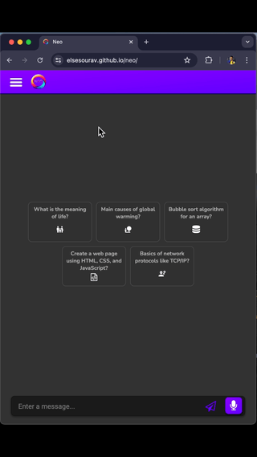
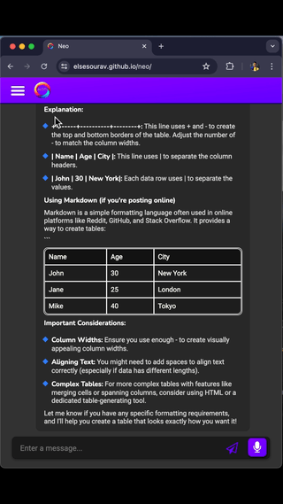
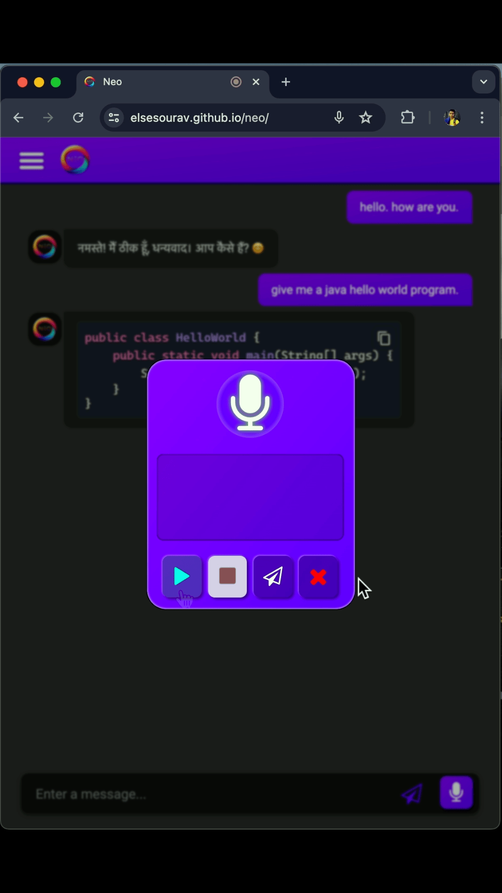
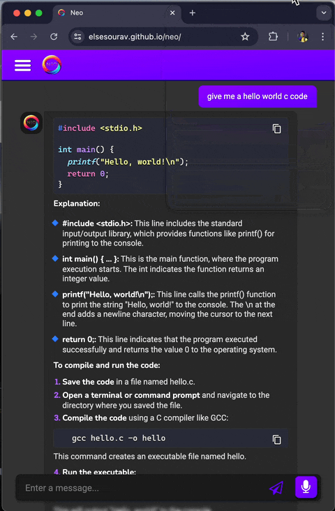

<h1 align="center"></h1>
<h1 align="center"> <a href="https://elsesourav.github.io/neo"> NEO</a></h1>

 ## `Overview`
 > '**Neo**' is an advanced chatbot built using web technologies such as JavaScript, CSS, and HTML. It integrates with the Gemini API and utilizes the Showdown.js and Highlight.js libraries. The chatbot is designed to provide a rich user experience with features such as audio chat, colorful code highlighting, and various user interface enhancements.

## `Features`
> - **Audio Chat:** Allows users to communicate with the chatbot using voice input and output.
> - **Colorful Code Highlighting:** Utilizes Highlight.js to display code snippets with syntax highlighting for better readability.
> - **Conversion History:** Saves chat history, allowing users to review past conversations.
> - **Copy Code:** Provides an easy way for users to copy code snippets from the chat.
> - **Chat Output in Tables:** Formats certain chat outputs in table structures for better organization and presentation.
> - **Light/Dark Theme:** Offers both light and dark themes for a customizable user interface.
> - **Beginning Question Suggestions:** Provides users with suggested questions to start the conversation, improving user engagement.

 

## `Technical Challenges`
### Audio Integration
> - Implementing reliable audio input/output due to varying browser support.
> - Managing latency in real-time audio processing.
> - Handling browsers that do not support the Web Speech API.

### Code Highlighting
> - Ensuring Highlight.js performs efficiently without causing the chat application to slow down.
> - Managing the processing load when highlighting multiple languages.
> - Preventing performance degradation when highlighting large code blocks.

### Light/Dark Theme
> - Maintaining consistent styling across different themes without duplicating CSS rules.
> - Ensuring all UI components adapt to theme changes dynamically and correctly.

## `Screenshot`
<table>
  <tr>
    <td>
      
    </td>
    <td>
      
    </td>
  </tr>
  <tr>
    <td>
      
    </td>
    <td>
      
    </td>
  </tr>
</table>

## `Compatibility`
### Browsers:
> - Ensure compatibility with major browsers like Chrome, Firefox, Safari, and Edge.
### Devices: 
> - Responsive design to ensure the chatbot works well on desktops, tablets, and mobile devices.

## `License`

### This project is licensed under the [MIT License](./LICENSE.md).

## `Contact`

### For questions or feedback, please contact me

-  [Email](https://elsesourav@gmail.com)
-  [Twitter](https://twitter.com/elsesourav)
-  [Linkedin](https://linkedin.com/in/elsesourav)
-  [Facebook](https://fb.com/elsesourav)
-  [Instagram](https://instagram.com/elsesourav)

 

<h2 align="center"> <a href="https://elsesourav.github.io/neo">Open Neo</a></h2>